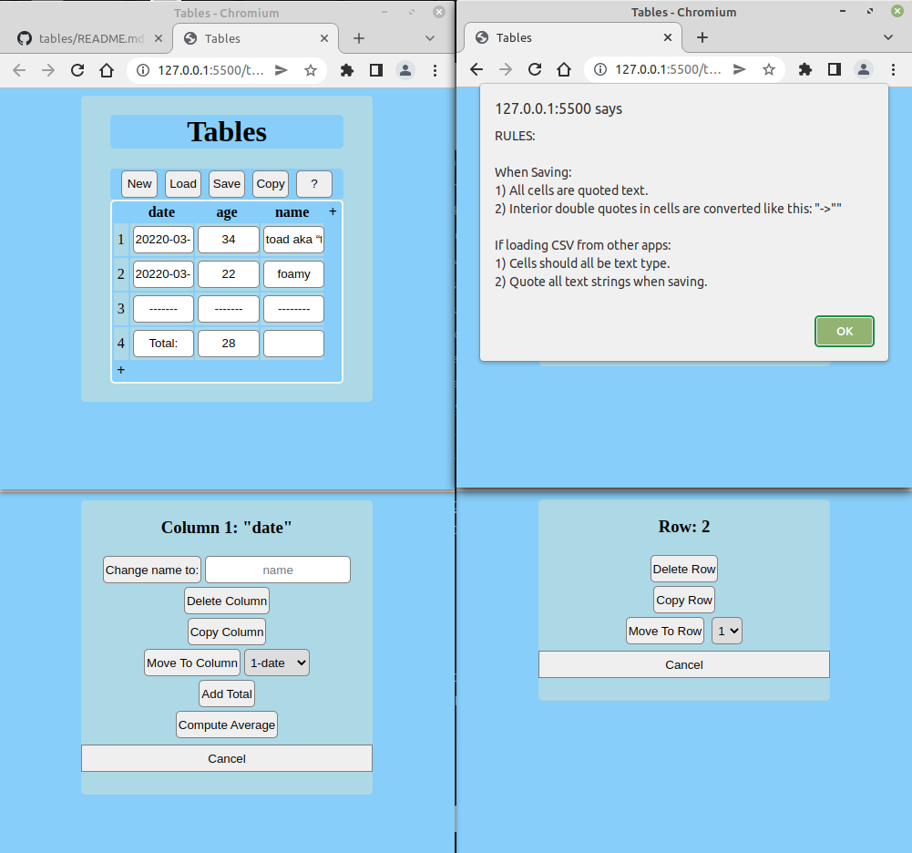

# tables
This is a simple CSV editor

This is an app in series of simple apps that can run wherever a broswer would.  This is useful for example where you want to ensure cross-platform functionality, or if you are loading a very simple or older linux distro, as long as it has an html5 browser available, these apps will run.  They load and save locally.  Apps in this series are intended to be:

1) Notes - a rudimentary word processor (done)
2) Tables - a rudimentary csv editor (done)
3) Calculator 
4) Mileage Tracker (done)
5) Time Sheet Tracker
6) Contacts
7) Calendar

 

